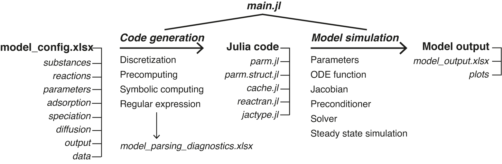

# User Guide

In this page we briefly discuss how to use SedTrace to generate diagenetic models.


## Installation
You should download and install `Julia` first: https://julialang.org/downloads. Your Julia version should be 1.7 or above to use `SedTrace`.
SedTrace is not registered with the Julia package manager. You need to install it directly from the GitHub repository. 
From the Julia REPL, type `]` to enter the Pkg REPL mode and run

```
pkg> add https://github.com/JianghuiDu/SedTrace.jl.git
```
I recommend using `Julia for Visual Studio Code` as the language editor. You can find relevent information at https://www.julia-vscode.org.

## First example
Now you can use the preincluded examples to see how `SedTrace` works. You should copy the `./SedTrace/examples` folder inside the `Julia` installation to a directory of your own choice (`./mydirector`), otherwise you won't be able to execute the examples. Now use `Visual Studio Code` to open the folder containing the example you want to check, for example, `./mydirectory/examples/SimpleFe`. Now open the 

## Workflow
The workflow of using SedTrace to generate and run diagenetic models is shown in the following figure. We will discuss each step in the sections below.



## Excel input
To generate code for the model user supplies an Excel file `model_config.xlsx` to SedTrace, including the following spreadsheets. The `substances` sheet lists the modelled substances, their types (e.g., solid or dissolved), chemical formula and boundary conditions. The `reactions` sheet lists the reactions, their chemical equations and rate expressions. The `speciation` sheet lists aqueous speciation reactions. The `adsorption` sheet lists the adsorbed species. The `diffusion` sheet  lists information to compute the diffusion coefficients of dissolved substances. The `parameters` sheet lists the parameters required by the model. The `output` sheet  is used to formulate output and plotting. The `data` sheet  includes observational data that will be plotted together with model outputs. The `speciation`, `adsorption` and `data` sheets are optional and can be left empty if not needed (but their column headers must be included).

## Julia code
The code generated by SedTrace is assembled into 5 Julia scripts: `parm.jl` and `parm.struct.jl` containing the model parameters, `cache.jl` containing the model cache, `reactran.jl` containing the reactive-transport code, and `jactype.jl` containing the sparsity pattern of the Jacobian. 

## Model simulation 

The workflow in `main.jl` begins with configuring the model using `modelconfig = ModelConfig(modeldirectory, modelfile, modelname)`, supplying information of model directory, the excel file and model name. If needed the user can call `generate_parameter_template(modelconfig;EnableList::Dictionary)`, which parses the substances, reactions, speciation and adsorption sheets to identify which parameters are needed by the model and output a template to assist the creation of the parameters sheet. Once the complete model configuration file is created, code generation is done by calling `generate_code(modelconfig; ParamDict::Dictionary, EnableList::Dictionary)`, creating the 5 Julia files discussed above. \


To assist easy model development, each of the spreadsheets in `model_config.xlsx` has a column `:include`, and setting its value to 1 means the corresponding row will be used by SedTrace to create the model. The argument `EnableList` helps the user to choose which information in the sheets should be included. Use `EnableList = Dict("sheetname"=>["row1","row2",...])` to include `row1`, `row2` etc. from the spreadsheet `sheetname` in the model. Similarly, `ParamDict` helps the user to change parameter values easily without modifying the excel sheet. `ParamDict = Dict("parameter_name"=>"parameter_value")` will change the value of `parameter_name` from the default value in the `parameters` sheet to `parameter_value` when generating code. The idea is that once the excel sheets are created the user should avoid modifying them, which is both inconvenient and potentially error-prone. Instead changes of the model information should be done using `EnableList` and `ParamDict` inside `main.jl`, which allows quick sensitive test and model prototyping. \


The Julia code files generated by SedTrace needs to be loaded into the workspace `module Main` by calling `IncludeFiles(modelconfig)`. The parameters are loaded into the `module Param`, and the cache and ODE function are loaded into the `module Cache`. During code generation, SedTrace collects the results of parsing the Excel inputs and outputs a file `model_parsing_diagnostics.xlsx`, which can help the user to diagnose potential issues of code generation.\


In the next step the users initializes the initial values, parameters, ODE function and Jacobian pattern. Internally SedTrace generates a set of initial values `C0 = Param.C0` that are constant with respect to depth based on user supplied boundary conditions. The user can also supply their own initial values for example using the output from previous model runs. The parameters are initialized by `parm = Param.ParamStruct()`. The ODE function is initialized using `OdeFun = Cache.init(C0, parm.Ngrid)`. The Jacobian sparsity pattern is initialized by `JacPrototype = JacType(Param.IDdict)`, where IDdict is a Julia Dictionary that stores the indices of the model substances. \


SedTrace also provides functions for code testing. Function `TestJacobian(JacPrototype, OdeFun, parm)` computes the Jacobian assuming it is dense, which is time consuming but accurate. The result is then compared with the Jacobian computed using `JacPrototype`. This thus serves as a check on code generation. `BenchmarkJacobian(JacPrototype, OdeFun, parm)`, `BenchmarkReactran(OdeFun, C0, parm)`, `BenchmarkPreconditioner(JacPrototype, OdeFun, parm)` are used to benchmark the performance and memory allocations of the Jacobian, ODE and preconditioner functions respectively.\


The user configures the numerical solver using `solverconfig = SolverConfig(:method, :preconditioner, prec_side)`, where `:method` is the numerical method such as `:GMRES`, :preconditioner is the name of the preconditioner, such as `:ILU0`, and `prec_side` controls whether it is left (1) or right (2) preconditioning. The numerical solution is configured using `solutionconfig = SolutionConfig(C0, tspan, reltol, abstol; callback)` to set the initial values (`C0`), the time span (`tspan`), and the tolerance (`reltol` for relative tolerance and `abstol` for absolute tolerance) for tests of numerical convergence. Any `callback` function compatible with the `DifferentialEquations.jl` can be supplied too. For example, the user can use `callback = TerminateSteadyState(rtol, atol)` from the `DiffEqCallbacks.jl` library to terminate the simulation once steady-state is reached given the relative and absolute tolerance levels of the derivatives (`rtol`  and `atol`). \


Model simulation is performed by calling `solution = modelrun(OdeFun, parm, JacPrototype, solverconfig ,solutionconfig)`. Internally SedTrace creates the Jacobian, solver and preconditioner functions and format the ODE function to be compatible with `DifferentialEquations.jl`, which carries out the numerical solution.\

## Model output
Model outputs are created by calling `generate_output(modelconfig, solution; site=nothing, showplt=true, saveplt=false)`. SedTrace will compute the output variables listed in the `output` sheet. New variables can be computed by supplying their mathematical expressions as functions of the model substances in the expression column. SedTrace also converts the default units to units specified by the user in the `unit_profile` column, using the conversion factors in the `conversion_profile` column. SedTrace can also computes the benthic fluxes of the output variables at the SWI. This is enables by set the `flux_top column` to 1. Similar to the model profiles, unit conversion for the flux is done using the `conversion_flux` and `unit_flux columns`. 


SedTrace then plots the profiles and the fluxes of the output variables. The user can supply the measured sediment profiles of these variables in the `data` sheet and the fluxes in the `flux_top_measured` column in the `output` sheet. SedTrace will plot the data with the model output. To do so the user needs to specify the site name in the `site` column and supply this name to `generate_output`. The name of the substance and the unit in the data sheet must match exactly those in the `output` sheet for SedTrace to match the model results with measurements. Data at measured depth intervals are supplied to the `depth` and `value` columns, with optional `error` values that will be used to create error bars on the plots. SedTrace will save the output in `model_output.xlsx`, containing direct output of modelled substances (sheet `Substances`), reaction rates (`ReacRates`), saturation state (`Omega`), pH related species (`pHspecies`), speciation results (`Speciation`) and intermediate variables (`IntermediateVar`) in the default SedTrace units. The user specified output is inside the `OutputProfile` and `OutputFlux` sheets with the custom units. If `saveplt = true` SedTrace will save the plots in the `plots` directory inside modeldirectory.
